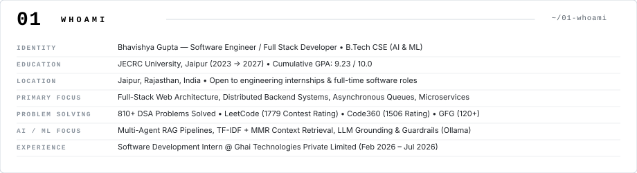
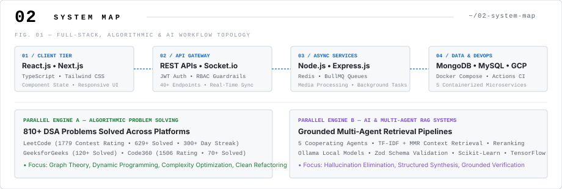
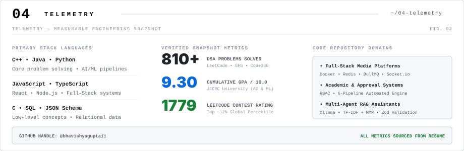
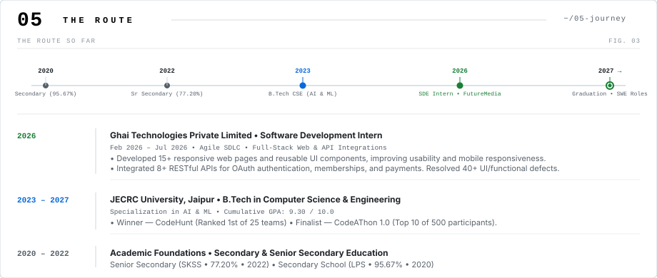
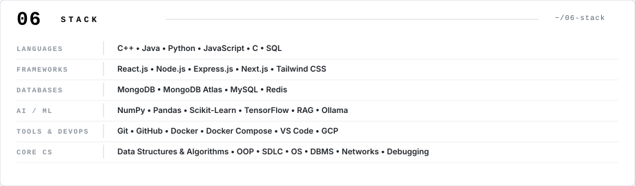
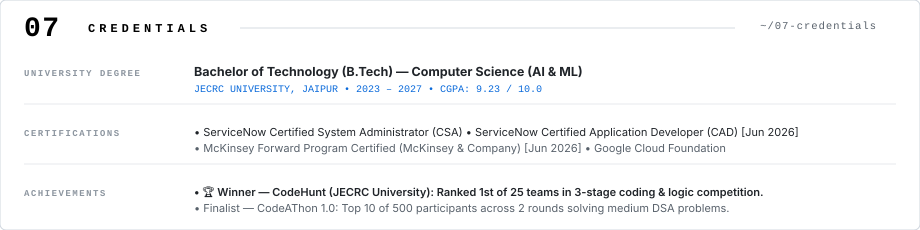

<picture>
  <source media="(prefers-color-scheme: dark)" srcset="assets/dark/01-hero.svg" />
  
</picture>

 

[PORTFOLIO](https://bhavishyaguptaportfolio.netlify.app/) &nbsp;&bull;&nbsp; [RESUME](https://bhavishyaguptaportfolio.netlify.app/assets/Bhavishya_Gupta_Resume.pdf) &nbsp;&bull;&nbsp; [GITHUB](https://github.com/bhavishyagupta11) &nbsp;&bull;&nbsp; [LINKEDIN](https://www.linkedin.com/in/bhavishyagupta001/) &nbsp;&bull;&nbsp; [EMAIL](mailto:bhavishyagupta001@gmail.com)

 

<picture>
  <source media="(prefers-color-scheme: dark)" srcset="assets/dark/02-whoami.svg" />
  
</picture>

 

<picture>
  <source media="(prefers-color-scheme: dark)" srcset="assets/dark/03-system-map.svg" />
  
</picture>

 

<picture>
  <source media="(prefers-color-scheme: dark)" srcset="assets/dark/04-projects.svg" />
  
</picture>

  <small>
    <b>FutureMedia:</b> <a href="https://futuremedia-one.vercel.app/">Live Deployment</a> &bull; <a href="https://github.com/bhavishyagupta11/FutureMedia-A-Social-Media-Platform">Source Code</a> &nbsp;&nbsp;|&nbsp;&nbsp; 
    <b>ScholrBoard:</b> <a href="https://scholr-board-360.vercel.app/">Live Platform</a> &nbsp;&nbsp;|&nbsp;&nbsp; 
    <b>CogniFlow:</b> <a href="https://github.com/bhavishyagupta11/CogniFlow">GitHub Repository</a>
  </small>

 

<picture>
  <source media="(prefers-color-scheme: dark)" srcset="assets/dark/05-telemetry.svg" />
  
</picture>

<picture>
  <source media="(prefers-color-scheme: dark)" srcset="https://github-readme-activity-graph.vercel.app/graph?username=bhavishyagupta11&bg_color=0d1117&color=00d4ff&line=00d4ff&point=f0f6fc&area_color=00d4ff&area=true&hide_border=true&radius=4&custom_title=CONTRIBUTION%20TELEMETRY" />
  
</picture>

 

<picture>
  <source media="(prefers-color-scheme: dark)" srcset="assets/dark/06-timeline.svg" />
  
</picture>

 

<picture>
  <source media="(prefers-color-scheme: dark)" srcset="assets/dark/07-stack.svg" />
  
</picture>

 

<picture>
  <source media="(prefers-color-scheme: dark)" srcset="assets/dark/08-education.svg" />
  
</picture>

 

<picture>
  <source media="(prefers-color-scheme: dark)" srcset="assets/dark/09-footer.svg" />
  
</picture>

[PORTFOLIO](https://bhavishyaguptaportfolio.netlify.app/) &nbsp;&bull;&nbsp; [RESUME](https://bhavishyaguptaportfolio.netlify.app/assets/Bhavishya_Gupta_Resume.pdf) &nbsp;&bull;&nbsp; [GITHUB](https://github.com/bhavishyagupta11) &nbsp;&bull;&nbsp; [LINKEDIN](https://www.linkedin.com/in/bhavishyagupta001/) &nbsp;&bull;&nbsp; [EMAIL](mailto:bhavishyagupta001@gmail.com)

