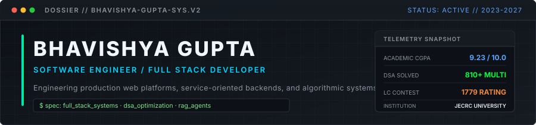
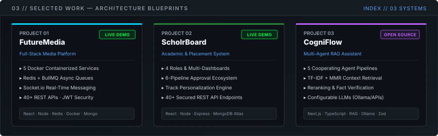
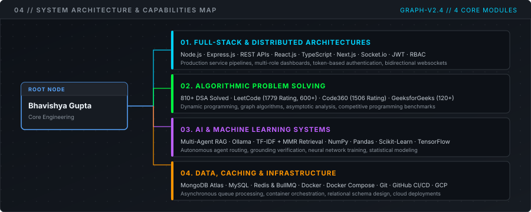
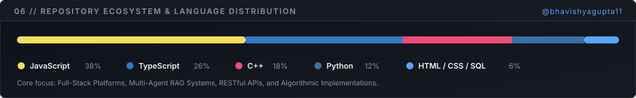
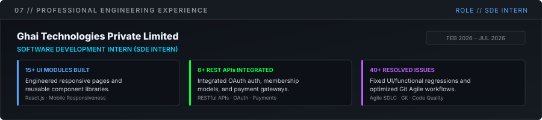

<div align="center">



<br />

[Portfolio](https://bhavishyaguptaportfolio.netlify.app/) &nbsp;&bull;&nbsp; [GitHub](https://github.com/bhavishyagupta11) &nbsp;&bull;&nbsp; [LinkedIn](https://www.linkedin.com/in/bhavishyagupta001/) &nbsp;&bull;&nbsp; [Email](mailto:bhavishyagupta001@gmail.com) &nbsp;&bull;&nbsp; [Resume](https://bhavishyaguptaportfolio.netlify.app/assets/Bhavishya_Gupta_Resume.pdf)

</div>

<br />

---

### 01 &mdash; WHOAMI

I am a Computer Science undergraduate specializing in Artificial Intelligence and Machine Learning at JECRC University, Jaipur (CGPA: 9.23 / 10.0). My technical foundation centers on full-stack web development, backend engineering, and algorithmic problem solving.

I engineer production-oriented applications with React, Next.js, Node.js, and relational/document databases, alongside practical machine learning and multi-agent RAG pipelines. With 810+ DSA problems solved across competitive programming platforms and hands-on SDE internship experience, I focus on building reliable software with clean architecture, strict data validation, and measurable performance.

---

### 02 &mdash; CURRENT FOCUS

| Domain | Focus Area | Technologies & Methodologies |
| :--- | :--- | :--- |
| **Problem Solving** | Advanced algorithmic optimization & graph theory | C++, Java, Dynamic Programming, Asymptotic Analysis |
| **Full Stack** | Production web applications & real-time communication | React.js, Next.js, TypeScript, Tailwind CSS, WebSockets |
| **Backend Engineering** | Asynchronous task queues, API security & auth systems | Node.js, Express.js, REST APIs, Redis, BullMQ, JWT, RBAC |
| **AI & Machine Learning** | Multi-agent RAG pipelines & context grounding | Python, Ollama, TF-IDF + MMR Retrieval, Scikit-Learn, TensorFlow |
| **System Architecture** | Containerization, CI/CD pipelines & cloud services | Docker, Docker Compose, Git, GitHub Actions, GCP, Vercel |

---

### 03 &mdash; SELECTED WORK



#### 01 / FutureMedia &mdash; Full-Stack Communication & Media Platform
A hybrid full-stack social media platform engineered for high-concurrency interactions, real-time messaging, and containerized deployment.
* **Architecture:** Containerized 5 distinct microservices using Docker Compose. Implemented Redis-backed BullMQ for asynchronous queue handling of background workflows and media processing.
* **Real-Time & Security:** Integrated Socket.io for low-latency bidirectional messaging. Enforced multi-layered security including JWT authentication, RBAC, and input sanitization.
* **API Footprint:** Designed and implemented 40+ RESTful API endpoints across 6 MongoDB collections.
* **Stack:** React.js, Node.js, Express.js, MongoDB, Socket.io, Redis, BullMQ, Docker, JWT, Cloudinary
* **Status:** LIVE
* **Links:** [Live Demo](https://futuremedia-one.vercel.app/) &nbsp;&bull;&nbsp; [GitHub Repository](https://github.com/bhavishyagupta11/FutureMedia-A-Social-Media-Platform)

#### 02 / ScholrBoard &mdash; Academic Performance & Placement Platform
An enterprise-grade academic platform built to manage multi-stakeholder approval workflows, student portfolios, and placement discovery.
* **Architecture:** Architected a full-stack MERN application with 4 hierarchical roles (Student, Faculty, Admin, Recruiter) and 4 dedicated dashboard views.
* **Approval Ecosystem:** Engineered a 6-pipeline automated approval workflow system with 5 automated escalation triggers and persistent audit tracking.
* **Personalization Engine:** Built a track-personalization engine auto-mapping 100% of student records into specialized academic and placement tracks.
* **Stack:** React.js, Node.js, Express.js, MongoDB Atlas, JWT, Cloudinary, Nodemailer, REST APIs
* **Status:** LIVE
* **Links:** [Live Demo](https://scholr-board-360.vercel.app/)

#### 03 / CogniFlow &mdash; Multi-Agent RAG Research Assistant
An intelligent research assistant orchestrating cooperating autonomous agents for grounded document synthesis and context retrieval.
* **Agent Architecture:** Implemented 5 specialized agents that route queries, retrieve context over a TF-IDF + MMR pipeline, rerank passages, synthesize structured answers, and verify factual grounding.
* **Guardrails & Schema:** Enforced strict JSON schema validation using Zod to eliminate hallucinations and malformed outputs.
* **Model Orchestration:** Built a provider-agnostic engine supporting local models via Ollama as well as remote LLM APIs.
* **Stack:** Next.js, TypeScript, Tailwind CSS, shadcn/ui, RAG Architecture, Ollama, Zod
* **Status:** OPEN SOURCE
* **Links:** [GitHub Repository](https://github.com/bhavishyagupta11/CogniFlow)

---

### 04 &mdash; ENGINEERING PROFILE



```
Bhavishya Gupta (Core Engineering)
│
├── 01. Applications & Interfaces
│   ├── React.js / Next.js / TypeScript
│   ├── State Architecture & Component Modularity
│   └── Tailwind CSS / Responsive Design Systems
│
├── 02. Backend & Distributed Services
│   ├── Node.js / Express.js REST API Architecture
│   ├── Asynchronous Queues (Redis / BullMQ)
│   └── WebSockets (Socket.io) / JWT Authentication / RBAC
│
├── 03. Data Persistence & Caching
│   ├── Document Stores: MongoDB / MongoDB Atlas
│   ├── Relational Databases: MySQL
│   └── In-Memory / Caching: Redis
│
├── 04. AI, Machine Learning & RAG
│   ├── Multi-Agent Workflows & Context Grounding (Ollama, MMR)
│   └── Scientific Computing: NumPy, Pandas, Scikit-Learn, TensorFlow
│
└── 05. DevOps & Infrastructure
    ├── Containerization: Docker / Docker Compose
    ├── Version Control & Automation: Git, GitHub Actions CI/CD
    └── Cloud Hosting: Google Cloud Platform (GCP), Vercel, Netlify
```

---

### 05 &mdash; PROBLEM SOLVING

Competitive programming and algorithmic problem solving are core components of my daily engineering discipline.

| Platform | Handle | Verified Snapshot | Metrics & Focus |
| :--- | :--- | :--- | :--- |
| **LeetCode** | [`@bhavishyagupta001`](https://leetcode.com/u/bhavishyagupta001/) | 629+ Solved (195 Easy &bull; 322 Med &bull; 112 Hard) | **1779** Contest Rating (Top ~12%) &bull; Longest Streak: 300+ days |
| **GeeksforGeeks** | [`@bhavishyarqb`](https://www.geeksforgeeks.org/user/bhavishyarqb/) | 120+ Solved | Core DSA Problem Sets &bull; Mathematical & Bitwise Logic |
| **Code360** | [`@bhavigupta`](https://www.naukri.com/code360/profile/bhavigupta) | 70+ Solved | **1506** Contest Rating &bull; Interview Preparation Tracks |
| **Codolio** | [`@bhavigupta`](https://codolio.com/profile/bhavigupta) | Multi-Platform Aggregation | Unified Cross-Platform Progress & Activity Tracking |
| **Combined** | &mdash; | **810+ Total DSA Problems Solved** | Graph Theory, Dynamic Programming, Trees, Asymptotic Optimization |

#### Competitions & Milestones
* **Winner &mdash; CodeHunt (JECRC University):** Ranked 1st among 25 teams in a 3-stage programming and algorithmic logic competition.
* **Finalist &mdash; CodeAThon 1.0 (JECRC University):** Advanced to the top 25 of 500 participants across 2 qualifying rounds, finishing in the top 10 by solving DSA problems in the final round.

---

### 06 &mdash; GITHUB TELEMETRY



---

### 07 &mdash; EXPERIENCE



#### Software Development Intern &mdash; Ghai Technologies Private Limited
*Feb 2026 &ndash; Jul 2026*

* Developed 15+ responsive web pages and reusable UI components, improving usability and cross-device responsiveness.
* Integrated 8+ RESTful APIs for Google/Facebook OAuth authentication, membership lifecycles, and payment workflows within an Agile team structure.
* Resolved 40+ UI and functional bugs across Git-based SDLC workflows, improving application stability and testing accuracy.
* **Technologies:** React.js, RESTful APIs, OAuth 2.0, Payment Integration, Git, Agile SDLC

---

### 08 &mdash; TECHNICAL STACK

| Classification | Technologies |
| :--- | :--- |
| **Languages** | C++, Java, Python, JavaScript, TypeScript, C, SQL |
| **Frontend** | React.js, Next.js, TypeScript, Tailwind CSS, HTML5, CSS3, Vite |
| **Backend & APIs** | Node.js, Express.js, RESTful APIs, WebSockets (Socket.io), JWT, RBAC |
| **Databases & Storage** | MongoDB, MongoDB Atlas, MySQL, Redis, Cloudinary |
| **AI & Machine Learning** | Python, NumPy, Pandas, Scikit-Learn, TensorFlow, Keras, RAG Architectures, Ollama |
| **DevOps & Cloud Tools** | Git, GitHub, Docker, Docker Compose, GitHub Actions, Google Cloud Platform (GCP), Vercel, Netlify |
| **Core CS Fundamentals** | Data Structures & Algorithms, Object-Oriented Programming (OOP), DBMS, Operating Systems, Computer Networks |

---

### 09 &mdash; EDUCATION

#### Bachelor of Technology (B.Tech) &mdash; Computer Science & Engineering
**JECRC University, Jaipur** &bull; *2023 &ndash; 2027*
* **Specialization:** Artificial Intelligence & Machine Learning
* **Cumulative GPA:** **9.23 / 10.0**
* **Relevant Coursework:** Data Structures & Algorithms, Object-Oriented Programming, Database Management Systems, Operating Systems, Computer Networks, Design & Analysis of Algorithms, Machine Learning Foundations, Deep Learning, Probability & Statistics.

---

### 10 &mdash; CONNECT

* **Email:** [bhavishyagupta001@gmail.com](mailto:bhavishyagupta001@gmail.com)
* **Portfolio:** [bhavishyaguptaportfolio.netlify.app](https://bhavishyaguptaportfolio.netlify.app/)
* **LinkedIn:** [linkedin.com/in/bhavishyagupta001](https://www.linkedin.com/in/bhavishyagupta001/)
* **GitHub:** [github.com/bhavishyagupta11](https://github.com/bhavishyagupta11)
* **Resume:** [Download Resume PDF](https://bhavishyaguptaportfolio.netlify.app/assets/Bhavishya_Gupta_Resume.pdf)
